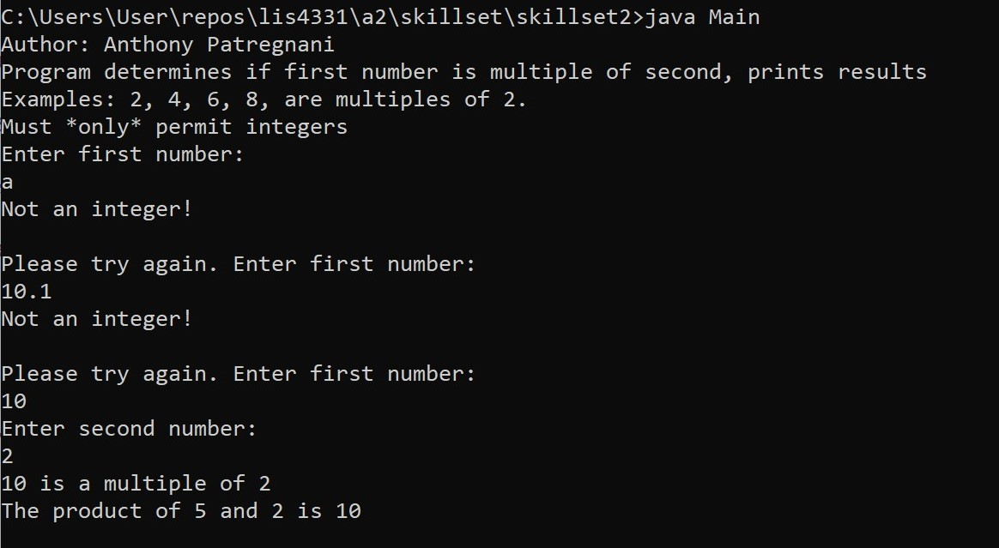

> **NOTE:** This README.md file should be placed at the **root of each of your repos directories.**
>
>Also, this file **must** use Markdown syntax, and provide project documentation as per below--otherwise, points **will** be deducted.
>

# LIS4331

## Anthony Patregnani

### Assignment #2 Requirements:

*Three Parts:*

1. Distributed Version Control with Git and Bitbucket
2. Reverse engineer Android App
3. Chapter Questions

#### README.md file should include the following items:

* Screenshot of running With Calcs
* Screenshot of running Without Calcs

#### Assignment Screenshots:

*Screenshot of running With Calcs*:

*Screenshot of running With out Calcs*:

| *Screenshot of running Skillset1*:  |   | *Screenshot of running Skillset2*:  |   | *Screenshot of running Skillset3*:  |
|---|---|---|---|---|
|   |   |   |   |   |
