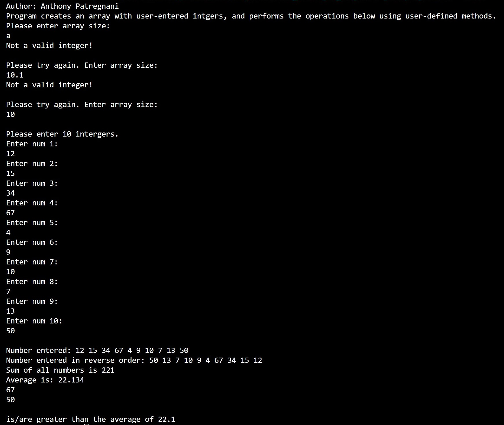

> **NOTE:** This README.md file should be placed at the **root of each of your repos directories.**
>
>Also, this file **must** use Markdown syntax, and provide project documentation as per below--otherwise, points **will** be deducted.
>

# LIS4331

## Anthony Patregnani

### Assignment #4 Requirements:

*Three Parts:*

1. Distributed Version Control with Git and Bitbucket
2. Reverse engineer Android App
3. Chapter Questions

#### Assignment Screenshots:

| *Screenshot of running RSS Feed*: |  *Screenshot of running RSS Item*: | *Screenshot of linked article*: |  |   |
|---|---|---|---|---|
|  |   |  |  |  |

| *Screenshot of running Skillset13*:  |   | *Screenshot of running Skillset14*:  |   | *Screenshot of running Skillset15*:  |
|---|---|---|---|---|
|   |   |   |   |   |
